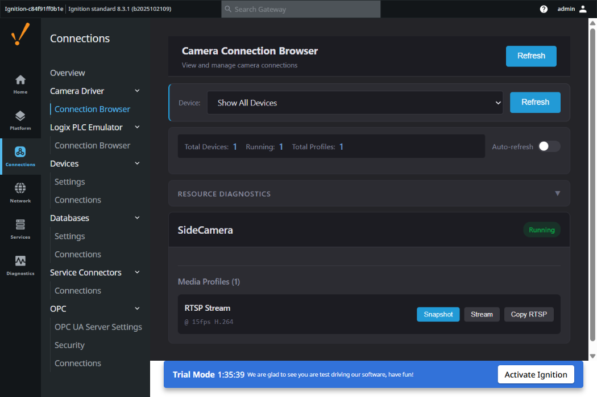
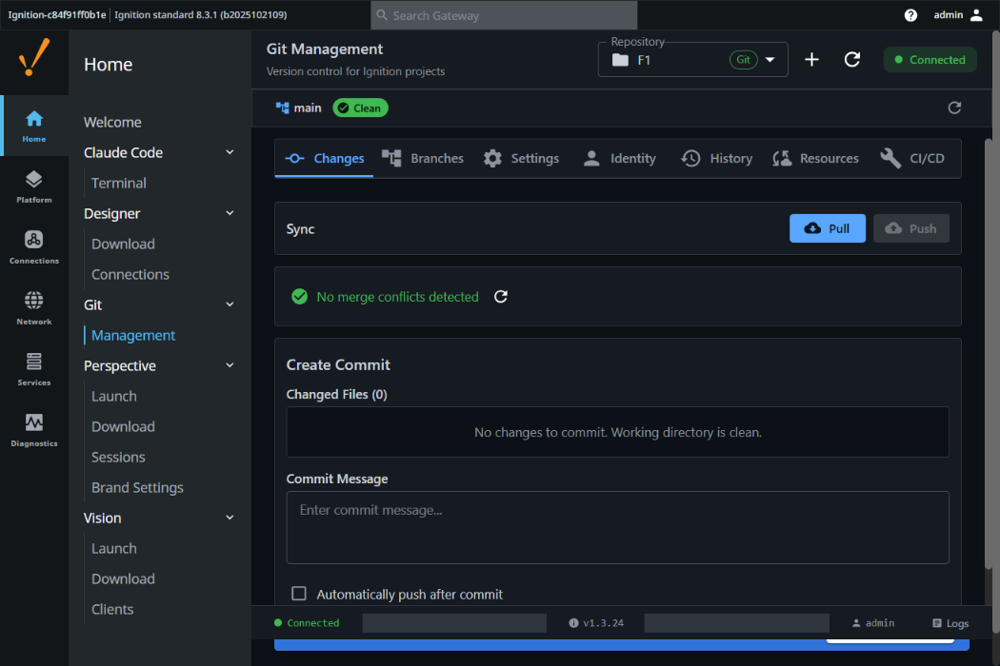

  <h1 align="center">Gaskony Ignition Modules</h1>
  

    Production-ready modules for Inductive Automation Ignition 8.3+
  

  
  
  
  

---

## Table of Contents

- [Overview](#overview)
- [Modules](#modules)
  - [Camera Driver](#camera-driver)
  - [Claude AI Terminal](#claude-ai-terminal)
  - [Git Integration](#git-integration)
  - [Logix PLC Emulator](#logix-plc-emulator)
  - [Python 3 Integration](#python-3-integration)
- [Getting Started](#getting-started)
- [Compatibility](#compatibility)
- [Support](#support)

---

## Overview

This portal provides downloads for the **Gaskony Ignition Module Suite** - five production-ready modules that extend Inductive Automation's Ignition platform with camera integration, AI assistance, version control, PLC emulation, and Python 3 scripting. All modules are built for **Ignition 8.3+** with **Java 17** and are signed for secure deployment.

---

## Modules

### Camera Driver

Multi-protocol camera integration supporting ONVIF, RTSP, MJPEG, and snapshot URL connections.

| | |
|---|---|
| **Latest Version** | v2.7.8 |
| **Download** | [CameraDriver-2.7.8.modl](https://github.com/Gaskony-Ignition/ignition-modules-portal/releases/download/camera-driver-v2.7.8/CameraDriver-2.7.8.modl) |
| **Size** | 18 MB |

**Features:**
- ONVIF device discovery and management
- Generic Camera support (RTSP, MJPEG, Snapshot URL)
- Embedded go2rtc streaming engine
- Connection Browser for device setup
- OPC-UA tag integration for camera data

---

### Claude AI Terminal

AI-powered coding assistant integrated directly into Ignition Gateway, providing Claude AI access for development and troubleshooting.

| | |
|---|---|
| **Latest Version** | v5.25.2 |
| **Download** | [ClaudeCode-WebUI-5.25.2.modl](https://github.com/Gaskony-Ignition/ignition-modules-portal/releases/download/claude-code-v5.25.2/ClaudeCode-WebUI-5.25.2.modl) |
| **Size** | 46 MB |

**Features:**
- Claude AI chat interface in Gateway WebUI
- Auto-load context from Claude session files
- File download with context tracking
- System log monitoring panel
- Terminal integration with scroll management

**Requirements:** Claude API key (configured in module settings)

---

### Git Integration

Full Git version control for Ignition projects directly from the Designer and Gateway.

| | |
|---|---|
| **Latest Version** | v1.3.27 |
| **Download** | [Ignition-Git-Module-1.3.27.modl](https://github.com/Gaskony-Ignition/ignition-modules-portal/releases/download/git-module-v1.3.27/Ignition-Git-Module-1.3.27.modl) |
| **Size** | 28 MB |

**Features:**
- Clone, commit, push, pull, and branch management
- SSH key authentication with Ignition secrets management
- Gateway WebUI for repository configuration
- Designer toolbar with commit dialog and status bar
- Automatic remote URL sync

---

### Logix PLC Emulator

Emulate Allen-Bradley Logix PLC devices with configurable tag structures for development and testing without physical hardware.

| | |
|---|---|
| **Latest Version** | v8.2.11 |
| **Download** | [LogixPLCEmulator-8.2.11.modl](https://github.com/Gaskony-Ignition/ignition-modules-portal/releases/download/logix-emulator-v8.2.11/LogixPLCEmulator-8.2.11.modl) |
| **Size** | 12 MB |

**Features:**
- Multiple emulated device types with realistic data patterns
- Per-tag emulation control
- Tag browser with search and filtering
- File-based device configuration (import/export)
- Gateway WebUI integration

<!-- Screenshot coming soon -->

---

### Python 3 Integration

Full Python 3 scripting environment with an integrated IDE in the Ignition Designer.

| | |
|---|---|
| **Latest Version** | v3.4.0 |
| **Download** | [Python3-3.4.0.modl](https://github.com/Gaskony-Ignition/ignition-modules-portal/releases/download/python3-integration-v3.4.0/Python3-3.4.0.modl) |
| **Size** | 50 MB |

**Features:**
- Python 3 Integration in Designer with syntax highlighting
- Script management with folder organisation and import/export
- Process pool architecture (3-20 concurrent Python processes)
- REST API for remote Python execution (OpenAPI compliant)
- Find/Replace, themes (Dark, Light, VS Code Dark+), diagnostics
- 184+ tests with comprehensive coverage

**Requirements:** Python 3.8+ installed on the Gateway server

<!-- Screenshot coming soon - Python 3 Integration is a Designer-only module -->

---

## Getting Started

### Prerequisites

- **Ignition 8.3+** (Gateway running with Java 17)
- Module-specific requirements listed in each module section above

### Installation

1. Download the `.modl` file for the module you want to install
2. Open your Ignition Gateway web interface (typically `http://localhost:8088`)
3. Navigate to **Config > System > Modules**
4. Click **Install or Upgrade a Module**
5. Select the downloaded `.modl` file and click **Install**
6. Restart the Gateway if prompted

### Upgrading

Follow the same installation steps - Ignition will detect the existing module and upgrade it in place. Your configuration will be preserved.

---

## Compatibility

| Module | Version | Ignition | Java | Additional Requirements |
|--------|---------|----------|------|------------------------|
| Camera Driver | v2.7.8 | 8.3+ | 17 | Network access to cameras |
| Claude AI Terminal | v5.25.2 | 8.3+ | 17 | Claude API key |
| Git Integration | v1.3.27 | 8.3+ | 17 | Git server (GitHub, GitLab, etc.) |
| Logix PLC Emulator | v8.2.11 | 8.3+ | 17 | None |
| Python 3 Integration | v3.4.0 | 8.3+ | 17 | Python 3.8+ on server |

All modules are signed and compatible with Ignition's module security model.

---

## Support

For issues, feature requests, or questions about any module, please [open an issue](https://github.com/Gaskony-Ignition/ignition-modules-portal/issues) on this repository.

---

  Built by <a href="https://github.com/Gaskony-Ignition">Gaskony Ignition</a>

