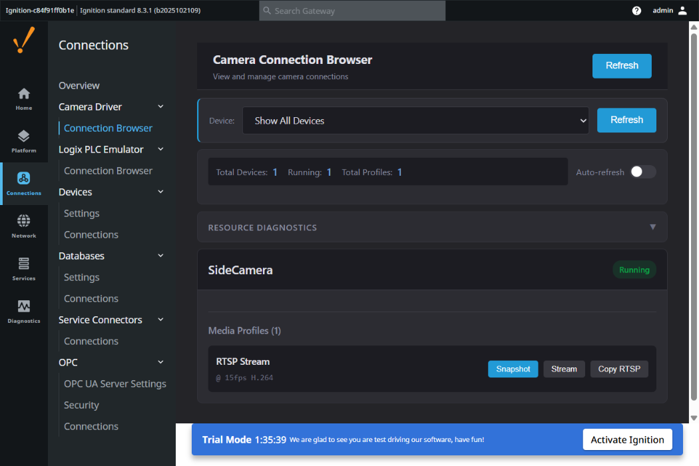
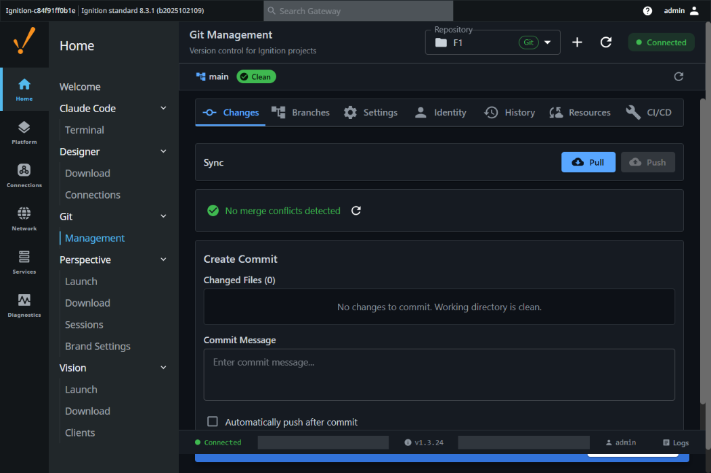

# Gaskony Ignition Modules

Independent, open-source modules for Inductive Automation's
[Ignition](https://inductiveautomation.com/) platform (8.3+), with a browsable
download portal at
[gaskony-ignition.github.io/ignition-modules-portal](https://gaskony-ignition.github.io/ignition-modules-portal/).

## Why this exists

Each module lives in its own private source repository, which is not a
convenient place to point someone who just wants the latest signed `.modl`.
This repo is that place: one page, one table, direct downloads, no GitHub
account required.

## What it looks like

*Camera Driver's Gateway connection browser, showing a live RTSP profile.*

*Git Integration's Gateway panel, showing sync status and commit controls for a project repository.*

## What it does

| Module | Latest | Licence | Source |
| ------ | ------ | ------- | ------ |
| Camera Driver | v3.2.1 | Apache-2.0 | [module-camera-driver](https://github.com/Gaskony-Ignition/module-camera-driver) |
| Logix PLC Emulator | v11.0.0 | Apache-2.0 | [module-plc-emulator](https://github.com/Gaskony-Ignition/module-plc-emulator) |
| Python 3 Integration | v4.6.2 | Apache-2.0 | [module-python3](https://github.com/Gaskony-Ignition/module-python3) |
| Git Integration | v3.2.2 | Beerware | [module-git-integration](https://github.com/Gaskony-Ignition/module-git-integration) |
| Script IDE | v1.25.0 | Apache-2.0 | [module-script-ide](https://github.com/Gaskony-Ignition/module-script-ide) |

Git Integration is a fork, not original work here: it was created by Enzo
Sagnelonge at [AXONE-IO](https://www.axone-io.com/) and substantially reworked by
[OperaMetrix](https://github.com/operametrix/ignition-git-module), who maintain
it. This build adds gitignore management on the gateway Versioning page and
change indicators in the Designer's Project Browser. The Beerware notice is
retained, as that licence requires.

All modules are signed and built for Ignition 8.3+ (Java 17).

## How to use it

1. Open the [download portal](https://gaskony-ignition.github.io/ignition-modules-portal/)
   and pick a module and version, or grab a `.modl` from a
   [release](../../releases) directly.
2. In the Gateway, go to **Config → Modules → Install or Upgrade a Module** and
   select the file.
3. Accept the signing certificate — every build is signed with the Gaskony
   certificate.

## Questions & contributions

> **⚠️ These modules are not actively supported.** They are published as-is,
> open source, under the licence shown against each module above. Issues are
> looked at when time allows and may sit for a while — a pull request on the
> relevant module's source repository is the fastest route to getting
> something fixed or added. For Git Integration, changes that are not specific
> to this build belong upstream at OperaMetrix.

---
*Independent project — not affiliated with, endorsed by, or supported by
Inductive Automation. "Ignition" is a trademark of Inductive Automation, LLC.
Software is provided without warranty of any kind, under each module's own
licence.*
